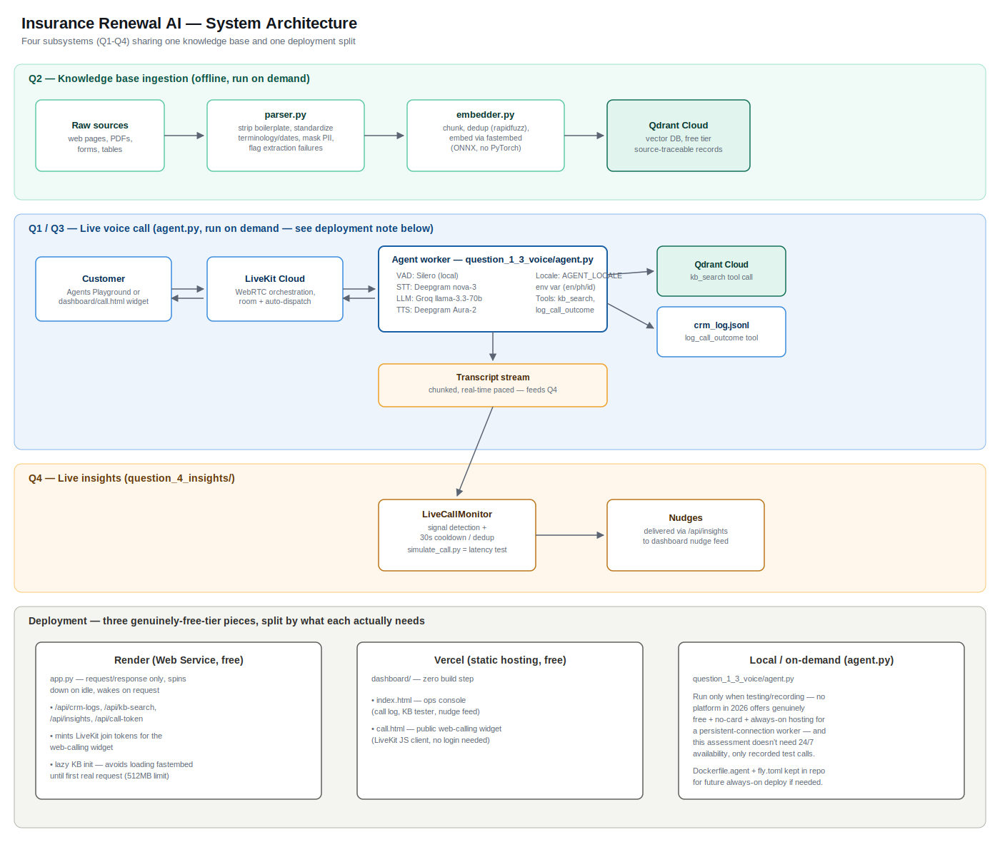

 


## What's built
- **Q2 knowledge base**: `question_2_kb/parser.py` (extraction + cleaning + PII
  masking), `question_2_kb/embedder.py` (chunking, dedup, Qdrant Cloud upsert,
  grounded retrieval), `question_2_kb/seed_ingest.py` (sample content loader).
- **Q1 voice agent**: `question_1_3_voice/agent.py` — a self-hosted LiveKit
  Agents worker. `kb_search` (grounds every FAQ/objection/policy answer in
  the Q2 KB) and `log_call_outcome` (mock CRM action) are in-process function
  tools, not external webhooks.
- **Q1 assistant config**: `question_1_3_voice/prompts.py` (system prompt,
  call flow, escalation rules) — reused as-is by `agent.py`.
- **Test evidence templates**: `retrieval_tests/run_retrieval_tests.py` (Q2's
  5-query log) and `test_calls/test_scenarios.md` (Q1's 5 call scripts).

## Tech Stack

| Layer | Technology / Provider | Notes |
|-------|------------------------|-------|
| **Vector Database** | Qdrant Cloud | Stores and retrieves vector embeddings |
| **Embeddings** | sentence-transformers | Generates semantic embeddings |
| **Voice Orchestration** | LiveKit Cloud (Build Tier) | Manages real-time audio streaming and sessions |
| **Speech-to-Text (STT)** | Deepgram (Nova-3) | Converts speech to text |
| **Text-to-Speech (TTS)** | Deepgram (Aura-2) | Generates natural-sounding speech |
| **Large Language Model (LLM)** | Groq (Llama 3.3 70B Versatile) | Handles reasoning and response generation |
| **Voice Activity Detection (VAD)** | Silero | Runs locally; no API key required |

 

## Run sequence

### 1. Install + configure
```bash
cd ai_assessment_voice_free_local
pip install -r requirements.txt
cp .env.example .env
```
Fill in `.env`:
- `QDRANT_URL` / `QDRANT_API_KEY` — free cluster at https://cloud.qdrant.io
- `GROQ_API_KEY` — free key at https://console.groq.com/keys
- `DEEPGRAM_API_KEY` — free $200 credit at https://console.deepgram.com
- `LIVEKIT_URL` / `LIVEKIT_API_KEY` / `LIVEKIT_API_SECRET` — free Build-tier
  project at https://cloud.livekit.io

### 2. Seed and verify the knowledge base (Q2)
```bash
python -m question_2_kb.seed_ingest
python -m retrieval_tests.run_retrieval_tests
```
 

### 3. Run the voice agent  

 
Run it locally whenever you're about to test or record:
```bash
python -m question_1_3_voice.agent dev
```
 
 

### 5. Talk to the agent — 
 
open https://agents-playground.livekit.io, sign in with the same LiveKit
Cloud project, and start talking. This is LiveKit's own hosted testing UI —
free, zero code.

### 6. Deploy — two services need to be always reachable; the agent doesn't

 

| Piece | What it is | Where | Why there |
|---|---|---|---|
| `app.py` | FastAPI — dashboard API + optional HTTP KB access | **Render** (Web Service, free) | Free tier covers Web Services (spins down after 15 min idle, wakes on request — fine for a dashboard API) |
| `dashboard/index.html` | Static ops console | **Vercel** (static hosting, free) | Zero build step, plain HTML/CSS/JS |

**6a. `app.py` → Render**
- New → Web Service → connect repo
- Build: `pip install -r requirements.txt`
- Start: `uvicorn app:app --host 0.0.0.0 --port $PORT`
- Env vars: `QDRANT_URL`, `QDRANT_API_KEY`, `COLLECTION_NAME`
- Once you have your Vercel URL (step 6b), add `DASHBOARD_ORIGIN=https://your-dashboard.vercel.app` so CORS only allows your dashboard

**6b. `dashboard/index.html` → Vercel**
```bash
cd dashboard
vercel deploy --prod
```
 
  

